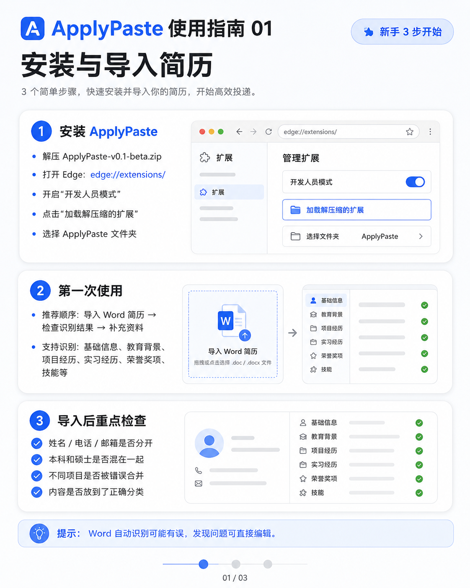
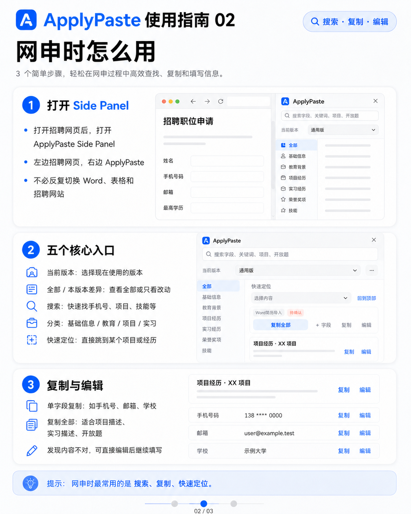
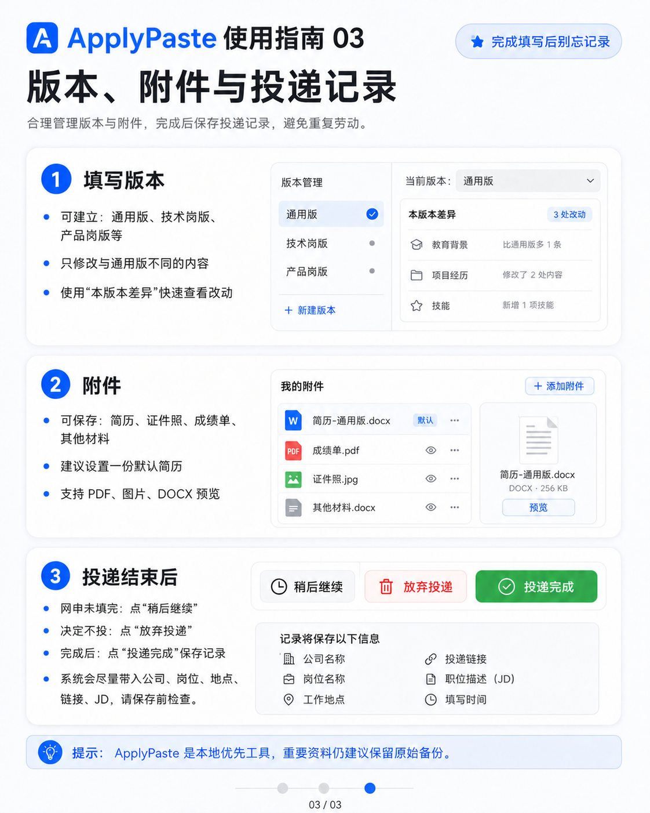
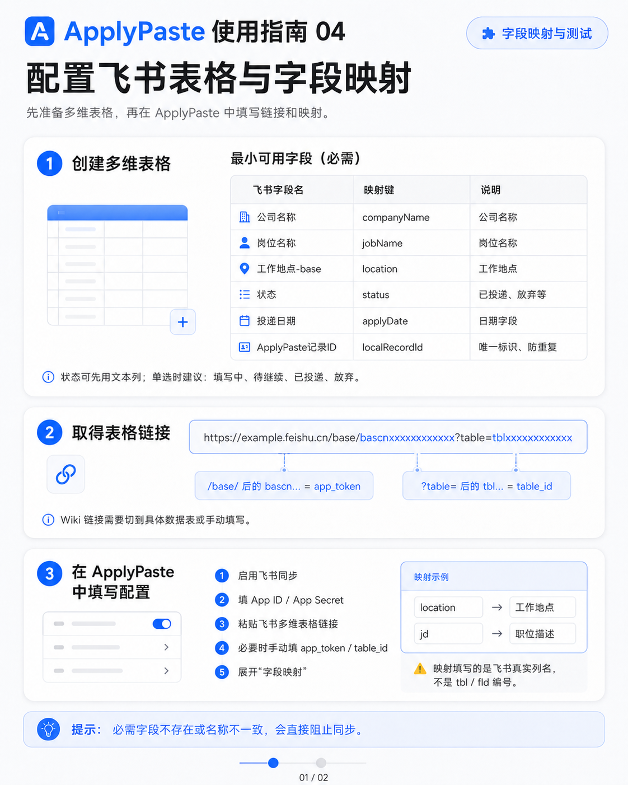
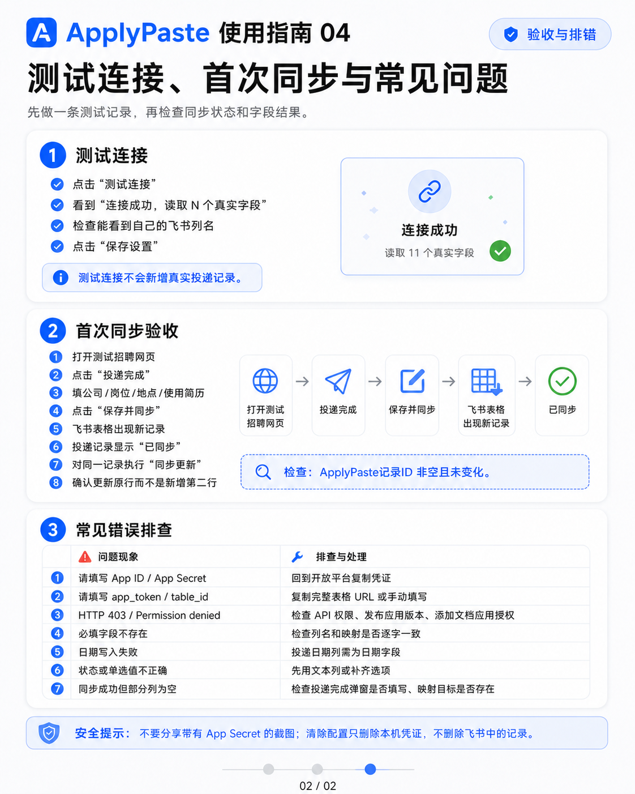

# ApplyPaste

> **一次整理，反复填写。**  
> 本地优先的浏览器网申资料管理与快速填写助手。

ApplyPaste 用来减少求职网申过程中反复寻找资料、复制个人信息、切换简历版本和记录投递状态的时间。

它不是自动投递机器人，而是一个放在招聘网页旁边的：

**个人网申资料库 + Side Panel 快速复制助手 + 投递记录工具。**

## ✨ 它能做什么？

### 📚 网申信息库

集中保存常用求职信息：

- 基础信息
- 教育背景
- 项目经历
- 实习经历
- 荣誉奖项
- 技能
- 开放题
- 常用附件

一个字段对应一个可直接复制的信息单元。

### 📄 Word 简历导入

上传 `.docx` 简历后，ApplyPaste 会尝试识别：

**基础信息 → 教育 → 项目 → 实习 → 技能 → 荣誉等内容**

识别完成后可以人工检查、编辑和补充。

> Word 排版差异较大，自动识别结果建议人工确认。

### 🧩 Side Panel 网申助手

填写招聘网站时，可以把 ApplyPaste 固定在浏览器侧边，无需反复切换招聘网页、Word、Excel 和资料库。

Side Panel 支持：

- 🔍 搜索
- 📂 分类
- ⚡ 快速定位
- 📋 单字段复制
- 📑 整卡复制
- ✏️ 现场编辑

### 🔀 多填写版本

同一份经历可以针对不同岗位保留不同表达，例如：

`通用版` · `技术岗版` · `产品岗版` · `咨询版`

ApplyPaste 使用“通用内容 + 当前版本差异”，不需要重复维护多套完整个人资料。

### 📎 附件管理

可以保存简历、证件照、成绩单、排名证明和其他常用材料。支持设置默认简历，并提供 PDF、图片和 DOCX 预览。

### ✅ 投递记录

网申结束后可以选择：

**稍后继续｜放弃投递｜投递完成**

ApplyPaste 会尽量识别当前招聘网页中的公司、岗位、地点、JD 和投递链接，并保存为独立投递记录。

### ☁️ 飞书同步（可选）

如果你使用飞书多维表格管理求职进度，可以配置飞书同步。支持 CREATE、UPDATE 和重试去重。

不配置飞书也不会影响 ApplyPaste 的任何核心本地功能。

## 🚀 快速开始

### 1. 安装

解压 ApplyPaste 后，在 Microsoft Edge 打开：

```text
edge://extensions/
```

然后依次执行：

**开启开发人员模式 → 加载解压缩的扩展 → 选择包含 `manifest.json` 的 ApplyPaste 文件夹**

### 2. 导入简历

打开 ApplyPaste：

**导入 Word 简历 → 检查识别结果 → 补充资料**

重点检查：

- 姓名、电话和邮箱是否正确拆分
- 本科和硕士是否混合
- 不同项目是否被错误合并
- 内容分类是否正确

### 3. 开始网申

打开招聘网页后，再打开 ApplyPaste Side Panel：

**搜索资料 → 复制 → 粘贴到网申页面**

### 4. 完成投递

完成网申后点击“投递完成”，确认岗位信息并保存记录。

## 🖼️ 使用指南

建议第一次使用时按照下面顺序操作。

### 01 · 安装与导入简历



### 02 · 网申时使用 Side Panel



### 03 · 版本、附件与投递记录



需要飞书同步时继续：

### 04 · 飞书表格与字段映射



### 05 · 同步测试与排错



## 🔒 数据与隐私

ApplyPaste 坚持：

> **Local First · 本地优先**

默认情况下：

- 不需要注册账号
- 不需要 ApplyPaste 服务器
- 不需要上传个人资料到 ApplyPaste 云端
- 不要求配置飞书

信息库、版本、附件和投递记录主要保存在当前浏览器本地。飞书同步只有在用户主动配置后才会启用。

重要资料请保留自己的 Word、PDF 原始文件，并建议定期导出完整备份。

## 📖 文档

### 用户文档

- [完整使用指南](docs/USER_GUIDE.md)
- [人工功能检查](docs/MANUAL_E2E_CHECKLIST.md)

### 开发与 AI 文档

- [项目目录说明](docs/PROJECT_STRUCTURE.md)
- [开发说明](docs/DEVELOPMENT.md)
- [功能继承审计](docs/FEATURE_PARITY.md)
- [Public Beta 审计](docs/PUBLIC_BETA_AUDIT.md)

## 📁 项目结构

```text
ApplyPaste/
├─ src/               浏览器扩展源码
├─ public-template/   新用户公共模板
├─ docs/              使用与开发文档
│  └─ images/         使用指南图片
├─ tests/             自动测试
├─ tools/             检查、隐私和发布工具
├─ manifest.json
├─ package.json
└─ README.md
```

安装 ZIP 等构建产物不放在源码目录中提交，后续通过 GitHub Releases 分发。

## 🧪 当前状态

**ApplyPaste v0.1 Beta**

Beta 版本：当前已覆盖核心网申流程，欢迎反馈实际使用中的问题。

当前目标是让求职者能够稳定完成：

**资料整理 → 网申复制 → 版本管理 → 投递记录**

目前适合：

- Microsoft Edge / Chromium 浏览器
- 中文校招、秋招及其他高频网申场景
- 使用 Word 简历的用户

## 💬 反馈问题

遇到 Bug 时，建议提供：

1. 操作步骤
2. 实际发生的结果
3. 预期结果
4. 截图

涉及简历或个人资料时，请先遮挡姓名、手机号、邮箱、身份证号等敏感信息。

## ApplyPaste

**整理一次，需要的时候直接找到、复制、填写。**

`Local First · Browser Extension`
